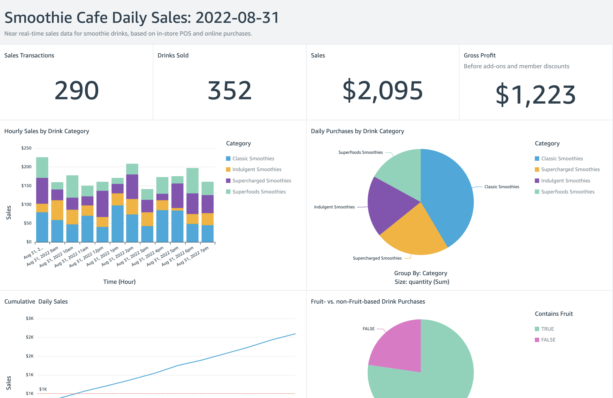

# Yet Another Streaming Data Generator (YASDG)

## TL;DR

1. Run the command `docker stack deploy kafka --compose-file docker-compose.yml` to create local instance of Kafka
2. Run the command `python3 -m pip install kafka-python` to install the `kafka-python` package
3. Run the command `python3 ./producer.py` to start generating streaming data to Kafka
4. Run the command `python3 ./consumer.py` in a separate terminal window to view results

## Background

Each time you want to explore or demonstrate a new streaming technology, you must first find
an adequate data source or develop a new source. Ideally, the streaming data source should be complex enough
to perform multiple types of analyses on and visualize different aspects with Business intelligence (BI) and dashboarding tools. Additionally,
the streaming data source should possess a degree of consistency and predictability while still displaying a reasonable level of natural randomness.
Conversely, the source should not result in an unnatural uniform distribution of data over time.

This project's highly configurable data generator (`producer.py`) streams beverage products, semi-random beverage sales transactions,
and inventory restocking activities to Apache Kafka topics. It is designed for demonstrating streaming data analytics tools,
such as Apache Spark Structured Streaming, Apache Beam, Apache Flink, Apache Pinot, Databricks, Google Cloud Dataproc,
and Amazon Kinesis Data Analytics.

## Highlights

* All configuration in a separate `configuration.ini` file
* Semi-random data generation - random variables are weighted and can be adjusted in `.ini` file
* Over 25 smoothie drink products in `products.csv`: descriptions, inventories, product weightings
* Writes initial product list to an Apache Kafka topic (topic 1/3)
* Generates streaming drink purchases, with time, item, quantity, price, total price, etc.
* Writes smoothie purchases to an Apache Kafka topic (topic 2/3)
* Club membership discounts semi-randomly applied to smoothie purchases
* Add-on supplements semi-randomly applied to smoothie purchases
* Restocks low product inventories based on a minimum value
* Writes restocking activities to a second Apache Kafka topic: time, old inventory, new inventory, etc. (topic 3/3)

## Raw Product List

Products are based on Tropical Smoothie menu
from [Fast Food Menu Prices](https://www.fastfoodmenuprices.com/tropical-smoothie-prices/). Last four columns with `_`
are were used to generate artificial product category and product weightings. These determine how frequently the
products are purchased in the simulation.

A few sample products from CSV file, `products.csv` are show below.

```text
ID,Category,Item,Size,Price,Inventory,ContainsFruit,ContainsVeggies,ContainsNuts,ContainsCaffeine,_CatWeight,_ItemWeight,_TotalWeight,_RangeWeight
CS01,Classic Smoothies,Sunrise Sunset,24 oz.,4.99,75,1,0,0,0,3,2,6,6
CS02,Classic Smoothies,Kiwi Quencher,24 oz.,4.99,75,1,0,0,0,3,5,15,21
SF07,Superfoods Smoothies,Detox Island Green,24 oz.,5.99,50,1,1,0,0,2,1,2,136
SC04,Supercharged Smoothies,Lean Machine,24 oz.,5.99,35,0,1,1,1,3,4,12,184
IS04,Indulgent Smoothies,Mocha Madness,24 oz.,5.49,60,0,0,1,1,4,2,8,242
```

## Products Topic

A few sample product messages are show below.

```json
[
    {
        "product_id": "CS01",
        "category": "Classic Smoothies",
        "item": "Sunrise Sunset",
        "size": "24 oz.",
        "price": 4.99,
        "inventory": 75,
        "contains_fruit": true,
        "contains_veggies": false,
        "contains_nuts": false,
        "contains_caffeine": false,
        "range_weight": 6
    },
    {
        "product_id": "SF01",
        "category": "Superfoods Smoothies",
        "item": "Island Green",
        "size": "24 oz.",
        "price": 5.99,
        "inventory": 50,
        "contains_fruit": true,
        "contains_veggies": true,
        "contains_nuts": false,
        "contains_caffeine": false,
        "range_weight": 108
    },
    {
        "product_id": "SC02",
        "category": "Supercharged Smoothies",
        "item": "Peanut Paradise",
        "size": "24 oz.",
        "price": 5.99,
        "inventory": 35,
        "contains_fruit": false,
        "contains_veggies": false,
        "contains_nuts": false,
        "contains_caffeine": false,
        "range_weight": 160
    },
    {
        "product_id": "SC03",
        "category": "Supercharged Smoothies",
        "item": "Health Nut",
        "size": "24 oz.",
        "price": 5.99,
        "inventory": 35,
        "contains_fruit": false,
        "contains_veggies": false,
        "contains_nuts": true,
        "contains_caffeine": false,
        "range_weight": 172
    },
    {
        "product_id": "IS04",
        "category": "Indulgent Smoothies",
        "item": "Mocha Madness",
        "size": "24 oz.",
        "price": 5.49,
        "inventory": 60,
        "contains_fruit": false,
        "contains_veggies": false,
        "contains_nuts": true,
        "contains_caffeine": true,
        "range_weight": 242
    }
]
```

## Purchases Topic

A few sample sales transaction messages are show below. The `sample_data.json` file contains more sample data.

```json
[
    {
        "transaction_time": "2022-08-30 12:57:07.942191",
        "product_id": "CS10",
        "price": 4.99,
        "quantity": 2,
        "is_member": false,
        "member_discount": 0.0,
        "add_supplements": false,
        "supplement_price": 0.0,
        "total_purchase": 9.98
    },
    {
        "transaction_time": "2022-08-30 12:57:11.113150",
        "product_id": "SC03",
        "price": 5.99,
        "quantity": 1,
        "is_member": false,
        "member_discount": 0.0,
        "add_supplements": false,
        "supplement_price": 0.0,
        "total_purchase": 5.99
    },
    {
        "transaction_time": "2022-08-30 12:57:12.338458",
        "product_id": "SC05",
        "price": 5.99,
        "quantity": 1,
        "is_member": true,
        "member_discount": 0.1,
        "add_supplements": false,
        "supplement_price": 0.0,
        "total_purchase": 5.39
    },
    {
        "transaction_time": "2022-08-30 12:57:14.584755",
        "product_id": "SF07",
        "price": 5.99,
        "quantity": 1,
        "is_member": true,
        "member_discount": 0.1,
        "add_supplements": true,
        "supplement_price": 1.99,
        "total_purchase": 7.18
    },
    {
        "transaction_time": "2022-08-30 12:57:18.787460",
        "product_id": "SC05",
        "price": 5.99,
        "quantity": 1,
        "is_member": false,
        "member_discount": 0.0,
        "add_supplements": true,
        "supplement_price": 1.99,
        "total_purchase": 7.98
    }
]
```

## Restocking Activity Topic

A few sample restocking activity messages are show below.

```json
[
    {
        "event_time": "2022-08-29 15:09:23.007874",
        "product_id": "SC05",
        "existing_level": 9,
        "stock_quantity": 15,
        "new_level": 24
    },
    {
        "event_time": "2022-08-29 15:12:30.415329",
        "product_id": "SC03",
        "existing_level": 10,
        "stock_quantity": 15,
        "new_level": 25
    },
    {
        "event_time": "2022-08-29 15:19:38.139400",
        "product_id": "SC01",
        "existing_level": 10,
        "stock_quantity": 15,
        "new_level": 25
    },
    {
        "event_time": "2022-08-29 15:34:35.392350",
        "product_id": "SC04",
        "existing_level": 9,
        "stock_quantity": 15,
        "new_level": 24
    },
    {
        "event_time": "2022-08-29 15:48:55.183778",
        "product_id": "IS01",
        "existing_level": 10,
        "stock_quantity": 15,
        "new_level": 25
    }
]
```

## Sample Dashboard

A sample dashboard created from the purchases topic's data.



## Commands

See [bitnami/kafka](https://hub.docker.com/r/bitnami/kafka) on Docker Hub for more information about running Kafka
locally using Docker.

```shell
# deploy kafka stack
docker swarm init
docker stack deploy kafka --compose-file docker-compose.yml

# optional: to exec into Kafka container
docker exec -it $(docker container ls --filter  name=kafka_kafka --format "{{.ID}}") bash
```

To run the application:

```shell
# install `kafka-python` python package
python3 -m pip install kafka-python

# run in foreground
python3 ./producer.py
# alternately, run as background process
nohup python3 ./producer.py &

python3 ./consumer.py
```

From within the Kafka container:

```shell
export BOOTSTRAP_SERVERS="localhost:9092"
export TOPIC_PRODUCTS="demo.products"
export TOPIC_PURCHASES="demo.purchases"
export TOPIC_STOCKINGS="demo.stockings"

# list topics
kafka-topics.sh --list --bootstrap-server $BOOTSTRAP_SERVERS

kafka-topics.sh --describe \
    --topic $TOPIC_PURCHASES \
    --bootstrap-server $BOOTSTRAP_SERVERS

# delete topics
kafka-topics.sh --bootstrap-server $BOOTSTRAP_SERVERS --delete --topic $TOPIC_PRODUCTS
kafka-topics.sh --bootstrap-server $BOOTSTRAP_SERVERS --delete --topic $TOPIC_PURCHASES
kafka-topics.sh --bootstrap-server $BOOTSTRAP_SERVERS --delete --topic $TOPIC_STOCKINGS

# optional: create partitions (or will be automatically created)
kafka-topics.sh --create --topic $TOPIC_PRODUCTS \
    --partitions 1 --replication-factor 1 \
    --config cleanup.policy=compact \
    --bootstrap-server $BOOTSTRAP_SERVERS

kafka-topics.sh --create --topic $TOPIC_PURCHASES \
    --partitions 1 --replication-factor 1 \
    --config cleanup.policy=compact \
    --bootstrap-server $BOOTSTRAP_SERVERS

kafka-topics.sh --create --topic $TOPIC_STOCKINGS \
    --partitions 1 --replication-factor 1 \
    --config cleanup.policy=compact \
    --bootstrap-server $BOOTSTRAP_SERVERS

# read topics from beginning
kafka-console-consumer.sh --bootstrap-server $BOOTSTRAP_SERVERS \
    --topic $TOPIC_PRODUCTS --from-beginning

kafka-console-consumer.sh --bootstrap-server $BOOTSTRAP_SERVERS \
    --topic $TOPIC_PURCHASES --from-beginning

kafka-console-consumer.sh --bootstrap-server $BOOTSTRAP_SERVERS \
    --topic $TOPIC_STOCKINGS --from-beginning
```

## Future Additions

* Add SASL/SCRAM authentication option for Apache Kafka (currently unauthenticated only)
* Add AWS IAM authentication option for Amazon MSK (currently unauthenticated only)
* Add the estimated cost to each product, allowing for profitability analyses
* Store products with real-time inventory levels in a datastore (e.g., Amazon DynamoDB)
* Add hours of operation (e.g., Monday 8AM - 8PM), which impact when sales can be made
* Add semi-random sales volume variability based on day and time of day (e.g., Friday evening vs. Monday morning)
* Add positive and negative sales anomalies variable, such as a winter storm, power outage, or marketing promotion
* Add supply change issues variable that could impact availability of certain products (zero inventory/lost sales)

---
_The contents of this repository represent my viewpoints and not of my past or current employers, including Amazon Web
Services (AWS). All third-party libraries, modules, plugins, and SDKs are the property of their respective owners. The
author(s) assumes no responsibility or liability for any errors or omissions in the content of this site. The
information contained in this site is provided on an "as is" basis with no guarantees of completeness, accuracy,
usefulness or timeliness._