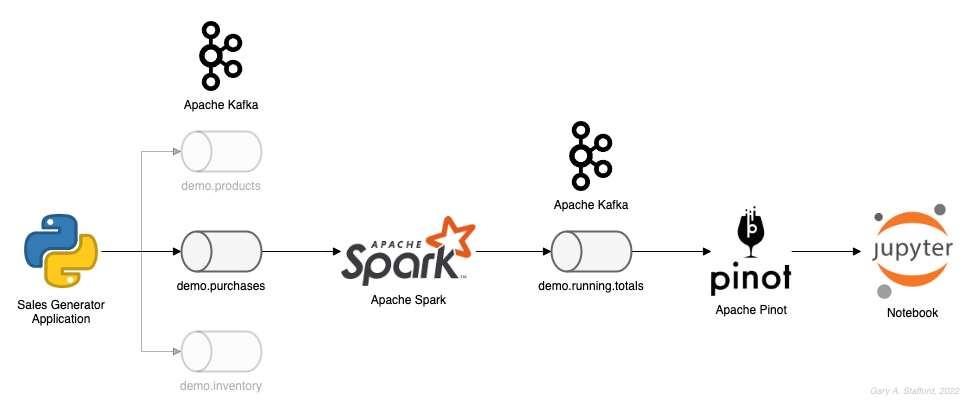
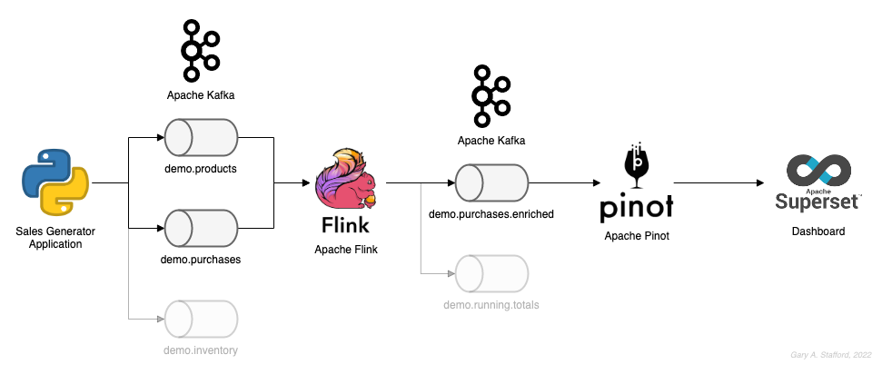

# Streaming Synthetic Sales Data Generator

## TL;DR

1. `docker stack deploy streaming-stack --compose-file docker/flink-spark-kafka-stack.yml` to create local instance of Kafka
2. `python3 -m pip install kafka-python` to install the `kafka-python` package
3. `python3 ./producer.py` to start generating streaming data to Apache Kafka
4. `python3 ./consumer.py` in a separate terminal window to view results

## Background

Each time you want to explore or demonstrate a new streaming technology, you must first find an adequate data source or
develop a new one. Ideally, the streaming data source should be complex enough to perform multiple types of analyses
on and visualize different aspects with Business Intelligence (BI) and dashboarding tools. Additionally, the streaming
data source should possess a degree of consistency and predictability while still displaying a reasonable level of
natural randomness. Conversely, the source should not result in an unnatural uniform distribution of data over time.

This project's highly configurable, Python-based, synthetic data generator ([producer.py](producer.py)) streams product listings,
sales transactions, and inventory restocking activities to Apache Kafka topics. It is designed for
demonstrating streaming data analytics tools, such as
[Apache Spark Structured Streaming](https://spark.apache.org/docs/latest/structured-streaming-programming-guide.html),
[Apache Beam](https://beam.apache.org/), [Apache Flink](https://flink.apache.org/),
[Apache Kafka Streams](https://kafka.apache.org/documentation/streams/),
[Apache Pinot](https://pinot.apache.org/), [Databricks](https://www.databricks.com/),
[Google Cloud Dataproc](https://cloud.google.com/dataproc),
and [Amazon Kinesis Data Analytics](https://aws.amazon.com/kinesis/data-analytics/).

## Video Demonstration

Short [YouTube video](https://youtu.be/MTCsN7gJuJM) demonstrates the generator in use (video only - no audio).


## Streaming Code Sample

  * Apache Spark Structured Streaming: [Code samples](./apache_spark_examples/) written with PySpark, which consumes and aggregates the 
real-time sales data from Kafka using Apache Spark
  * Apache Flink: [Code sample](https://github.com/garystafford/flink-kafka-demo/) written in Java, which consumes and aggregates the 
real-time sales data from Kafka using Apache Flink
  * Apache Kafka Streams (KStreams): [Code sample](https://github.com/garystafford/kstreams-kafka-demo/) written in Java, which consumes and aggregates the real-time sales data from Kafka using KStreams
  * Apache Pinot/Apache Superset: [Code sample](./apache_pinot_examples/) to query products, purchases, and purchases-enhanced streaming data from Kafka using SQL





## Project Features

* Generator is configurable in a separate [configuration.ini](configuration/configuration.ini) file
* Semi-random data generation - random variables are weighted and can be adjusted in `.ini` file
* Over 25 smoothie drink products in [products.csv](data/products.csv): descriptions, inventories, costs, ingredients,
  product propensity-to-buy range value
* The propensity to buy a product is determined by an assigned value from a range of 0 to 200
* Writes initial product list to an Apache Kafka topic (topic 1/3)
* Generates semi-random streaming drink purchases, with time, item, quantity, price, total price, etc.
* Club membership discounts semi-randomly applied to smoothie purchases
* Add-on supplements semi-randomly applied to smoothie purchases
* Writes smoothie purchases to an Apache Kafka topic (topic 2/3)
* Restocks low product inventories based on a minimum stock levels
* Writes restocking activities to an Apache Kafka topic with time, old level, new level, etc. (topic 3/3)
* Configurable authentication methods (SASL/SCRAM or PLAINTEXT) for connecting to Kafka

## Sample Dashboard

A simple dashboard example created from the streaming sales data joined with the static product list.


## Raw Product List

Products are based on Tropical Smoothie menu
from [Fast Food Menu Prices](https://www.fastfoodmenuprices.com/tropical-smoothie-prices/). Last four columns with `_`
are were used to generate artificial product category and product propensity-to-buy weighting. These determine how frequently the
products are purchased in the simulation.

A few sample products from CSV file, [products.csv](data/products.csv) are show below.

```text
ID,Category,Item,Size,COGS,Price,Inventory,ContainsFruit,ContainsVeggies,ContainsNuts,ContainsCaffeine,_CatWeight,_ItemWeight,_TotalWeight,_RangeWeight
CS01,Classic Smoothies,Sunrise Sunset,24 oz.,1.50,4.99,75,TRUE,FALSE,FALSE,FALSE,3,1,3,3
CS04,Classic Smoothies,Sunny Day,24 oz.,1.50,4.99,75,TRUE,FALSE,FALSE,FALSE,3,1,3,18
SF02,Superfoods Smoothies,Totally Green,24 oz.,2.10,5.99,50,TRUE,TRUE,FALSE,FALSE,2,1,2,84
SC01,Supercharged Smoothies,Triple Berry Oat,24 oz.,2.70,5.99,35,TRUE,FALSE,FALSE,FALSE,3,5,15,137
IS03,Indulgent Smoothies,Beach Bum,24 oz.,2.20,5.49,60,TRUE,TRUE,FALSE,FALSE,4,3,12,192
```

## Products Topic

A few sample product messages are show below.

```json
[
    {
        "event_time": "2022-09-11 14:39:46.934384",
        "product_id": "CS01",
        "category": "Classic Smoothies",
        "item": "Sunrise Sunset",
        "size": "24 oz.",
        "cogs": 1.5,
        "price": 4.99,
        "inventory": 75,
        "contains_fruit": true,
        "contains_veggies": false,
        "contains_nuts": false,
        "contains_caffeine": false,
        "propensity_to_buy": 3
    },
    {
        "event_time": "2022-09-11 14:39:50.715191",
        "product_id": "CS02",
        "category": "Classic Smoothies",
        "item": "Kiwi Quencher",
        "size": "24 oz.",
        "cogs": 1.5,
        "price": 4.99,
        "inventory": 75,
        "contains_fruit": true,
        "contains_veggies": false,
        "contains_nuts": false,
        "contains_caffeine": false,
        "propensity_to_buy": 6
    },
    {
        "event_time": "2022-09-11 14:39:54.232999",
        "product_id": "SF04",
        "category": "Superfoods Smoothies",
        "item": "Pomegranate Plunge",
        "size": "24 oz.",
        "cogs": 2.1,
        "price": 5.99,
        "inventory": 50,
        "contains_fruit": true,
        "contains_veggies": false,
        "contains_nuts": false,
        "contains_caffeine": false,
        "propensity_to_buy": 94
    },
    {
        "event_time": "2022-09-11 14:39:55.538469",
        "product_id": "SC03",
        "category": "Supercharged Smoothies",
        "item": "Health Nut",
        "size": "24 oz.",
        "cogs": 2.7,
        "price": 5.99,
        "inventory": 35,
        "contains_fruit": false,
        "contains_veggies": false,
        "contains_nuts": true,
        "contains_caffeine": false,
        "propensity_to_buy": 143
    },
    {
        "event_time": "2022-09-11 14:39:56.226351",
        "product_id": "IS01",
        "category": "Indulgent Smoothies",
        "item": "Bahama Mama",
        "size": "24 oz.",
        "cogs": 2.2,
        "price": 5.49,
        "inventory": 60,
        "contains_fruit": true,
        "contains_veggies": false,
        "contains_nuts": false,
        "contains_caffeine": false,
        "propensity_to_buy": 168
    }
]
```

## Purchases Topic

A few sample sales transaction messages are show below.

```json
[
    {
        "transaction_time": "2022-09-13 11:51:09.006164",
        "transaction_id": "9000324019618167755",
        "product_id": "CS06",
        "price": 4.99,
        "quantity": 1,
        "is_member": false,
        "member_discount": 0.0,
        "add_supplements": true,
        "supplement_price": 1.99,
        "total_purchase": 6.98
    },
    {
        "transaction_time": "2022-09-13 11:53:24.925539",
        "transaction_id": "9051670610281553996",
        "product_id": "SC04",
        "price": 5.99,
        "quantity": 1,
        "is_member": true,
        "member_discount": 0.1,
        "add_supplements": true,
        "supplement_price": 1.99,
        "total_purchase": 7.18
    },
    {
        "transaction_time": "2022-09-13 11:56:27.143473",
        "transaction_id": "6730925912413682784",
        "product_id": "SF03",
        "price": 5.99,
        "quantity": 1,
        "is_member": false,
        "member_discount": 0.0,
        "add_supplements": true,
        "supplement_price": 1.99,
        "total_purchase": 7.98
    },
    {
        "transaction_time": "2022-09-13 11:59:33.269093",
        "transaction_id": "2051718832449428473",
        "product_id": "CS04",
        "price": 4.99,
        "quantity": 1,
        "is_member": true,
        "member_discount": 0.1,
        "add_supplements": true,
        "supplement_price": 1.99,
        "total_purchase": 18.85
    },
    {
        "transaction_time": "2022-09-13 11:59:33.269093",
        "transaction_id": "2051718832449428473",
        "product_id": "SF07",
        "price": 5.99,
        "quantity": 2,
        "is_member": true,
        "member_discount": 0.1,
        "add_supplements": true,
        "supplement_price": 1.99,
        "total_purchase": 14.36
    }
]
```

### Sample Batch Data

The [sample_data_small.json](sample_batch_data/sample_data_small.json) file contains a batch of 290 purchases,
representing a typical 12-hour business day from 8AM to 8PM.
The [sample_data_large.json](sample_batch_data/sample_data_large.json) file contains 500 purchases,
spanning ~20.5 hours of sample data.

## Restocking Activity Topic

A few sample restocking activity messages are show below.

```json
[
    {
        "event_time": "2022-08-29 15:09:23.007874",
        "product_id": "SC05",
        "existing_level": 9,
        "stock_quantity": 15,
        "new_level": 24
    },
    {
        "event_time": "2022-08-29 15:12:30.415329",
        "product_id": "SC03",
        "existing_level": 10,
        "stock_quantity": 15,
        "new_level": 25
    },
    {
        "event_time": "2022-08-29 15:19:38.139400",
        "product_id": "SC01",
        "existing_level": 10,
        "stock_quantity": 15,
        "new_level": 25
    },
    {
        "event_time": "2022-08-29 15:34:35.392350",
        "product_id": "SC04",
        "existing_level": 9,
        "stock_quantity": 15,
        "new_level": 24
    },
    {
        "event_time": "2022-08-29 15:48:55.183778",
        "product_id": "IS01",
        "existing_level": 10,
        "stock_quantity": 15,
        "new_level": 25
    }
]
```

## Docker

See [bitnami/kafka](https://hub.docker.com/r/bitnami/kafka) on Docker Hub for more information about running Kafka
locally using Docker.

```shell
# optional: delete previous stack
docker stack rm streaming-stack

# deploy kafka stack
docker swarm init
docker stack deploy streaming-stack --compose-file docker/flink-spark-kafka-stack.yml

# optional: to exec into Kafka container
docker exec -it $(docker container ls --filter  name=streaming-stack_kafka.1 --format "{{.ID}}") bash
```

### Streaming Stacks

Example Apache Kafka, Spark, Flink, Pinot, Superset, and JupyterLab containers:

```text
CONTAINER ID   IMAGE                      PORTS                                    NAMES
1d7c6ab3009d   bitnami/spark:3.3                                                   streaming-stack_spark...
1d7c6ab3009d   bitnami/spark:3.3                                                   streaming-stack_spark-worker...
69ad1556eb3a   flink:1.15.2               6123/tcp, 8081/tcp                       streaming-stack_taskmanager.1...
9f9b8e43eb21   flink:1.15.2               6123/tcp, 8081/tcp                       streaming-stack_jobmanager.1...
6114dc4a9824   bitnami/kafka:3.2.1        9092/tcp                                 streaming-stack_kafka.1...
837c0cdd1498   bitnami/zookeeper:3.8.0    2181/tcp, 2888/tcp, 3888/tcp, 8080/tcp   streaming-stack_zookeeper.1...


CONTAINER ID   IMAGE                                  PORTS                                    NAMES
97ae95af3190   flink:1.15.2                           6123/tcp, 8081/tcp                       streaming-stack_taskmanager.1...
db2ef10587cd   flink:1.15.2                           6123/tcp, 8081/tcp                       streaming-stack_jobmanager.1...
f7b975f43087   bitnami/kafka:3.2.1                    9092/tcp                                 streaming-stack_kafka.1...
fb42722dccc0   jupyter/pyspark-notebook:spark-3.3.0   4040/tcp, 8888/tcp                       streaming-stack_jupyter.1...
fa74d7a69ff8   garystafford/superset-pinot:0.11.0     8088/tcp                                 streaming-stack_superset.1...
4ac637924d5f   apachepinot/pinot:0.11.0-...           8096-8099/tcp, 9000/tcp                  streaming-stack_pinot-server.1...
45a60ea9efce   apachepinot/pinot:0.11.0-...           8096-8099/tcp, 9000/tcp                  streaming-stack_pinot-broker.1...
2c3a910ed2a5   apachepinot/pinot:0.11.0-...           8096-8099/tcp, 9000/tcp                  streaming-stack_pinot-controller.1...
3b93a2daa1ee   zookeeper:3.8.0                        2181/tcp, 2888/tcp, 3888/tcp, 8080/tcp   streaming-stack_zookeeper.1...
```

## Helpful Commands

To run the application:

```shell
# install `kafka-python` python package
python3 -m pip install kafka-python

# run in foreground
python3 ./producer.py
# alternately, run as background process
nohup python3 ./producer.py &

python3 ./consumer.py
```

Manage the topics from within the Kafka container:

```shell
docker exec -it $(docker container ls --filter  name=streaming-stack_kafka.1 --format "{{.ID}}") bash

export BOOTSTRAP_SERVERS="localhost:9092"
export TOPIC_PRODUCTS="demo.products"
export TOPIC_PURCHASES="demo.purchases"
export TOPIC_STOCKINGS="demo.stockings"

# list topics
kafka-topics.sh --list \
    --bootstrap-server $BOOTSTRAP_SERVERS

kafka-topics.sh --describe \
    --topic $TOPIC_PURCHASES \
    --bootstrap-server $BOOTSTRAP_SERVERS

# delete topics
kafka-topics.sh --bootstrap-server $BOOTSTRAP_SERVERS --delete --topic $TOPIC_PRODUCTS
kafka-topics.sh --bootstrap-server $BOOTSTRAP_SERVERS --delete --topic $TOPIC_PURCHASES
kafka-topics.sh --bootstrap-server $BOOTSTRAP_SERVERS --delete --topic $TOPIC_STOCKINGS

# optional: create partitions (or will be automatically created)
kafka-topics.sh --create --topic $TOPIC_PRODUCTS \
    --partitions 1 --replication-factor 1 \
    --config cleanup.policy=compact \
    --bootstrap-server $BOOTSTRAP_SERVERS

kafka-topics.sh --create --topic $TOPIC_PURCHASES \
    --partitions 1 --replication-factor 1 \
    --config cleanup.policy=compact \
    --bootstrap-server $BOOTSTRAP_SERVERS

kafka-topics.sh --create --topic $TOPIC_STOCKINGS \
    --partitions 1 --replication-factor 1 \
    --config cleanup.policy=compact \
    --bootstrap-server $BOOTSTRAP_SERVERS

# read topics from beginning
kafka-console-consumer.sh \
    --topic $TOPIC_PRODUCTS --from-beginning \
    --bootstrap-server $BOOTSTRAP_SERVERS

kafka-console-consumer.sh \
    --topic $TOPIC_PURCHASES --from-beginning \
    --bootstrap-server $BOOTSTRAP_SERVERS

kafka-console-consumer.sh \
    --topic $TOPIC_STOCKINGS --from-beginning \
    --bootstrap-server $BOOTSTRAP_SERVERS
```

## TODO Items

* ✓ Add the estimated Cost of Goods Sold (COGS) to each product, allowing for gross profit analyses
* ✓ Add SASL/SCRAM authentication option for Apache Kafka in addition to PLAINTEXT
* ✓ Add streaming data analysis example using Apache Spark Structured Streaming
* ✓ Add streaming data analysis example using Apache Flink
* ✓ Add streaming data analysis example using Apache Kafka Streams (KStreams)
* ✓ Add streaming data analysis example using Apache Pinot with Apache Superset and JupyterLab
* ✓ Add event time to Product model so product changes can be accounted for in stream
* ✓ Docker streaming stack to support all examples: Apache Kafka, Spark, Flink, Pinot, Superset, and JupyterLab
* ✓ Enable multiple product sales to be associated with a single transaction, add transaction ID to Purchases Class
* ❏ Replace specific restocking events with more generic events topic with multiple event type field: restocking, price change, COGS change,
  ingredients, etc.
* ❏ Add hours of operation (e.g., Monday 8AM - 8PM), which impact when sales can be made
* ❏ Add semi-random sales volume variability based on day and time of day (e.g., Friday evening vs. Monday morning)
* ❏ Add positive and negative sales anomalies variable, such as a winter storm, power outage, or successful marketing
  promotion
* ❏ Add supply change issues variable that could impact availability of certain products (zero inventory/lost sales)

---
_The contents of this repository represent my viewpoints and not of my past or current employers, including Amazon Web
Services (AWS). All third-party libraries, modules, plugins, and SDKs are the property of their respective owners. The
author(s) assumes no responsibility or liability for any errors or omissions in the content of this site. The
information contained in this site is provided on an "as is" basis with no guarantees of completeness, accuracy,
usefulness or timeliness._
