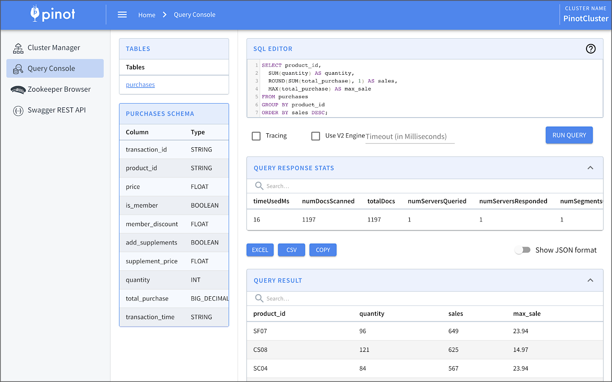
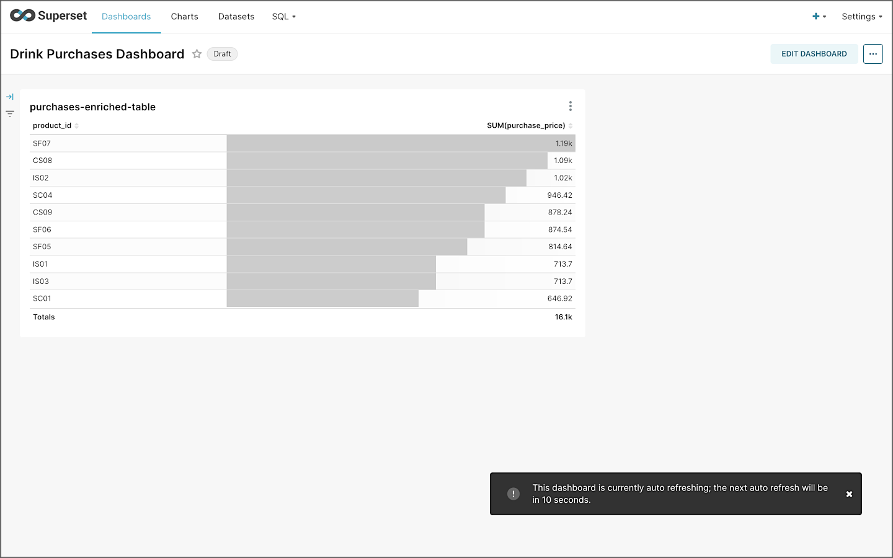

# Apache Pinot Instructions

Commands to run from host that is running Apache Flink/Pinot/Superset/Kafka Docker Swarm stack.

```shell
# optional: delete existing stack
docker stack rm streaming-stack

# deploy pinot/kafka stack
docker stack deploy streaming-stack --compose-file flink-pinot-superset-stack.yml

docker container ls --format "{{ .Names}}, {{ .Status}}"

# clone project locally
git clone https://github.com/garystafford/streaming-sales-generator.git
cd streaming-sales-generator/

# install `kafka-python` python package
python3 -m pip install kafka-python

# run in foreground
python3 ./producer.py
# alternately, run as background process
nohup python3 ./producer.py &
ps -alh

# create new pinot tables
cd ~/streaming-sales-generator/apache_pinot_examples
CONTROLLER_CONTAINER=$(docker container ls --filter  name=streaming-stack_pinot-controller.1 --format "{{.ID}}")

docker cp configs_schemas/ ${CONTROLLER_CONTAINER}:/tmp/

docker exec -it ${CONTROLLER_CONTAINER} \
  bin/pinot-admin.sh AddTable \
    -tableConfigFile /tmp/configs_schemas/purchases-config.json \
    -schemaFile /tmp/configs_schemas/purchases-schema.json -exec

docker exec -it ${CONTROLLER_CONTAINER} \
  bin/pinot-admin.sh AddTable \
    -tableConfigFile /tmp/configs_schemas/products-config.json \
    -schemaFile /tmp/configs_schemas/products-schema.json -exec

docker exec -it ${CONTROLLER_CONTAINER} \
  bin/pinot-admin.sh AddTable \
    -tableConfigFile /tmp/configs_schemas/purchases-enriched-config.json \
    -schemaFile /tmp/configs_schemas/purchases-enriched-schema.json -exec
```

Sample SQL Statements

```sql
-- products
SELECT
  COUNT(product_id) AS product_count,
  AVG(price) AS avg_price,
  AVG(cogs) AS avg_cogs,
  AVG(price) - AVG(cogs) AS avg_gross_profit
FROM
  products;

-- purchases
SELECT
  product_id,
  SUMPRECISION(quantity, 10, 2) AS quantity,
  SUMPRECISION(total_purchase, 10, 2) AS sales,
  AVG(total_purchase) AS avg_sale
FROM
  purchases
GROUP BY
  product_id
ORDER BY
  sales DESC;

-- purchasesEnriched
SET useStarTree = 'true';

SELECT
  product_id,
  product_name,
  product_category,
  SUMPRECISION(purchase_quantity, 10, 2) AS quantity,
  SUMPRECISION(total_purchase, 10, 2) AS sales
FROM
  purchasesEnriched
GROUP BY
  product_id,
  product_name,
  product_category
ORDER BY
  sales DESC;
```

## Preview





## Build Custom Apache Superset for Pinot

```shell
cd apache_superset
export TAG=0.11.0
docker build \
  -f Dockerfile \
  -t garystafford/superset-pinot:${TAG} .

docker push garystafford/superset-pinot:${TAG}
```

## Configure Apache Superset

```shell
SUPERSET_CONTAINER=$(docker container ls --filter  name=streaming-stack_superset.1 --format "{{.ID}}")

docker exec -it ${SUPERSET_CONTAINER} \
  superset fab create-admin \
    --username admin \
    --firstname Superset \
    --lastname Admin \
    --email admin@superset.com \
    --password admin

docker exec -it ${SUPERSET_CONTAINER} \
  superset db upgrade

# optional
# docker exec -it ${SUPERSET_CONTAINER} \
#   superset load_examples

docker exec -it ${SUPERSET_CONTAINER} \
  superset init
```

## Superset Pinot Database Connection String

```text
pinot+http://pinot-broker:8099/query?controller=http://pinot-controller:9000
pinot+http://pinot-broker:8099/query?controller=http://pinot-controller:9000/debug=true
```

## Enable Logging for Superset

Superset logging is off by default, making nearly impossible to troubleshoot errors. To enable, set `ENABLE_TIME_ROTATE = True` in Superset's `config.py`, line `717`. Logs will then be found at: `/app/superset_home/superset.log`.

## Jupyter Login

```shell
JUPYTER_CONTAINER=$(docker container ls --filter  name=streaming-stack_jupyter.1 --format "{{.ID}}")
docker logs ${JUPYTER_CONTAINER}

# find string, similar to: "/lab?token=98baea49b9363a25b0cc8fca429265d6408c9e19021e99e5"
```